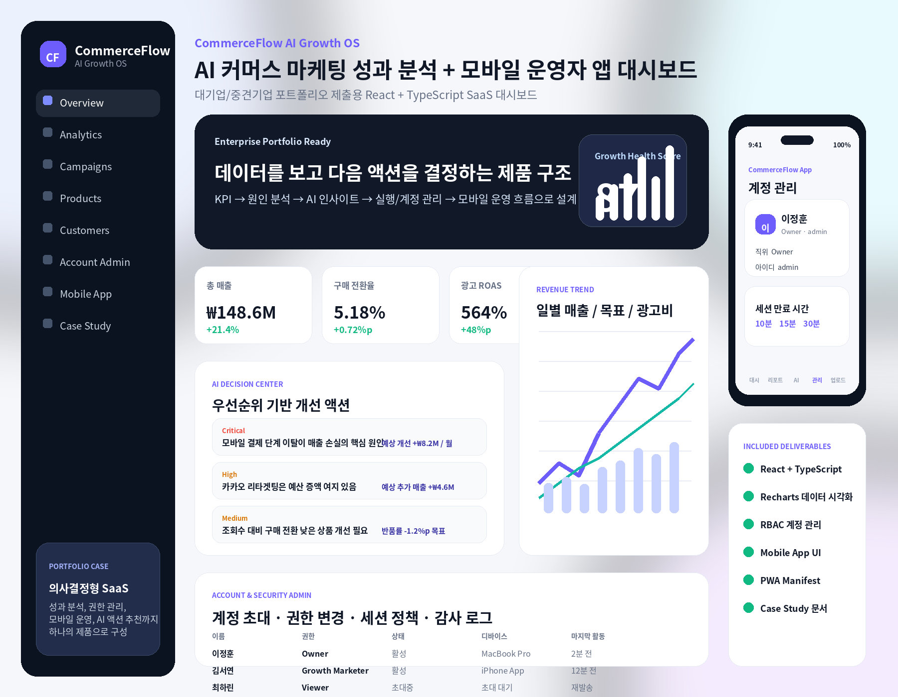
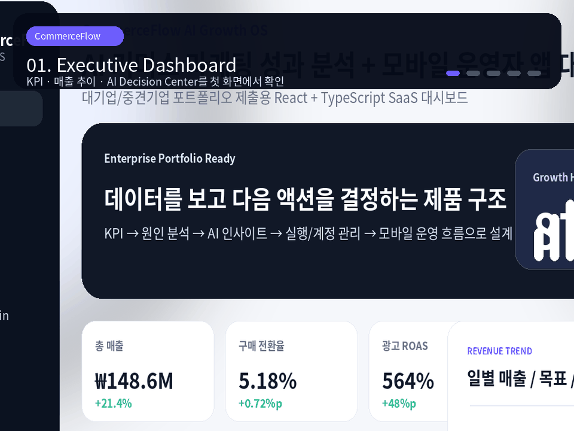

# CommerceFlow AI Growth OS



**AI 기반 커머스 마케팅 성과 분석 SaaS 대시보드 + 모바일 운영자 앱 UI** 포트폴리오 프로젝트입니다.  
운영자가 데이터를 확인하는 데서 끝나지 않고, **KPI → 원인 분석 → AI 인사이트 → 실행 우선순위 → 계정/권한 관리 → 모바일 운영**까지 이어지는 의사결정형 제품 구조로 설계했습니다.

> Live Demo: 배포 후 Vercel URL을 여기에 입력  
> Demo GIF: [`screenshots/commerceflow-demo.gif`](./screenshots/commerceflow-demo.gif)

---

## Demo Flow



---

## 1. Project Overview

| 항목 | 내용 |
|---|---|
| 프로젝트명 | CommerceFlow AI Growth OS |
| 유형 | AI 커머스 마케팅/운영 SaaS 대시보드 |
| 목표 직무 | Frontend, AI Service Planning, Data Analytics, Web/App UI |
| 구현 범위 | 반응형 웹 대시보드, 데이터 시각화, AI 인사이트, 캠페인 시뮬레이터, 상품 분석, 계정/권한 관리, 모바일 앱 UI |
| 데이터 방식 | TypeScript Mock Data + localStorage 상태 저장 |
| 배포 | Vercel-ready 설정 포함 |

---

## 2. Why This Project

커머스 운영자는 매출, 광고 효율, 상품 전환율, 고객 세그먼트, 운영자 계정 권한을 각각 다른 도구에서 확인하는 경우가 많습니다. 이 프로젝트는 흩어진 운영 데이터를 하나의 화면으로 통합하고, AI가 우선순위 기반 개선 액션을 제안하는 구조를 목표로 했습니다.

핵심 문제는 다음과 같이 정의했습니다.

```txt
데이터는 많지만, 오늘 무엇을 먼저 개선해야 하는지 판단하기 어렵다.
```

따라서 단순 지표 나열형 관리자 페이지가 아니라, **실무자가 다음 액션을 결정할 수 있는 Growth OS** 형태로 설계했습니다.

---

## 3. Key Features

### Executive Dashboard

- 총 매출, 구매 전환율, 광고 ROAS, 장바구니 이탈률 KPI
- 일별 매출/목표/광고비 추이
- 채널별 전환율 및 ROAS 비교
- 카테고리별 매출 비중
- 구매 전환 퍼널

### AI Decision Center

- 우선순위별 AI 개선 액션 카드
- 문제 원인, 근거 지표, 예상 효과, 담당자, 실행 기한 표시
- 모바일 결제 이탈, 캠페인 예산, 상품 상세페이지 개선 등 실무형 시나리오 반영

### Campaign Scenario Simulator

- 예산 재분배 비율 슬라이더
- 예상 추가 매출, 총 매출, 예상 ROAS 계산
- 마케팅 의사결정 흐름을 보여주는 데이터 기반 UI

### Product Analytics

- 상품명/카테고리 검색
- 매출, 전환율, 재고, 반품률 기준 정렬
- 상품별 리스크 표시

### Account & Security Admin

- 운영자 계정 초대
- 이메일 형식 검증 및 중복 체크
- 역할 변경 및 접근 중지/복구
- 세션 만료 시간 설정
- 권한별 접근 범위 매트릭스
- 이용 현황 및 감사 로그
- localStorage 기반 상태 저장

### Mobile Admin App UI

- 모바일 운영자 앱 프레임
- 하단 탭 인터페이스
- 대시보드, 리포트, AI 개선 제안, 관리, 업로드 화면
- React Native/Expo 앱으로 확장 가능한 IA 구조

---

## 4. Tech Stack

```txt
React
TypeScript
Vite
Recharts
Lucide React
CSS3
localStorage
PWA Manifest
Mock Data Modeling
```

---

## 5. Architecture

```txt
src/
├─ components/
│  ├─ AccountManagement.tsx
│  ├─ CampaignGrid.tsx
│  ├─ CampaignPlanner.tsx
│  ├─ ExecutiveReport.tsx
│  ├─ FunnelCard.tsx
│  ├─ InsightCard.tsx
│  ├─ KpiCard.tsx
│  ├─ MobileAppPreview.tsx
│  ├─ PermissionMatrix.tsx
│  ├─ ProductTable.tsx
│  ├─ SegmentPanel.tsx
│  ├─ Sidebar.tsx
│  └─ Topbar.tsx
├─ data/
│  └─ mockData.ts
├─ hooks/
│  └─ usePersistentState.ts
├─ utils/
│  └─ format.ts
├─ App.tsx
├─ main.tsx
├─ styles.css
└─ types.ts
```

---

## 6. Implementation Highlights

### Component-based UI

화면을 KPI, 차트, AI 인사이트, 캠페인, 상품 테이블, 계정 관리, 모바일 앱 프리뷰 단위로 분리했습니다. 각 컴포넌트는 props와 mock data를 기반으로 독립적으로 렌더링됩니다.

### TypeScript Data Modeling

캠페인, 상품, 고객 세그먼트, 운영자 권한, 감사 로그 데이터를 타입으로 명확히 정의했습니다. 데이터 구조를 UI와 분리해 실제 API 응답으로 교체하기 쉽게 구성했습니다.

### Persistent Admin State

운영자 초대, 권한 변경, 세션 만료 시간은 `usePersistentState` 커스텀 훅을 통해 localStorage에 저장됩니다. 새로고침 후에도 관리 상태가 유지됩니다.

### Data Visualization

Recharts를 활용해 매출 추이, 채널 성과, 카테고리 매출 비중을 시각화했습니다. 운영자가 지표의 변화와 원인을 빠르게 파악할 수 있도록 차트와 인사이트 카드를 함께 배치했습니다.

---

## 7. Getting Started

```bash
npm install
npm run dev
```

브라우저에서 확인합니다.

```txt
http://localhost:5173
```

빌드 확인:

```bash
npm run build
```

타입 체크:

```bash
npm run typecheck
```

---

## 8. Deployment

Vercel 배포 설정이 포함되어 있습니다.

```txt
Framework Preset: Vite
Build Command: npm run build
Output Directory: dist
```

자세한 업로드/배포 절차는 아래 문서를 확인합니다.

- [`docs/DEPLOYMENT_GUIDE.md`](./docs/DEPLOYMENT_GUIDE.md)
- [`docs/GITHUB_CHECKLIST.md`](./docs/GITHUB_CHECKLIST.md)

---

## 9. Portfolio Documents

- [`docs/CASE_STUDY.md`](./docs/CASE_STUDY.md)
- [`docs/TECHNICAL_BRIEF.md`](./docs/TECHNICAL_BRIEF.md)
- [`docs/INTERVIEW_SCRIPT.md`](./docs/INTERVIEW_SCRIPT.md)
- [`docs/PORTFOLIO_SUBMISSION_COPY.md`](./docs/PORTFOLIO_SUBMISSION_COPY.md)
- PDF: [`docs/pdf/CommerceFlow_Case_Study.pdf`](./docs/pdf/CommerceFlow_Case_Study.pdf)
- PDF: [`docs/pdf/CommerceFlow_Interview_Script.pdf`](./docs/pdf/CommerceFlow_Interview_Script.pdf)

---

## 10. Current Limitations

현재 버전은 프론트엔드 중심의 포트폴리오 프로토타입입니다.

- 실제 로그인/회원가입은 구현하지 않았습니다.
- 서버 DB 저장은 Mock Data와 localStorage로 대체했습니다.
- 권한 검증은 UI 레벨이며, 서버 사이드 RBAC 검증은 포함하지 않았습니다.
- 모바일 앱은 React Native가 아닌 웹 기반 모바일 앱 UI 프리뷰입니다.

실서비스 확장 시 Supabase/Firebase Auth, PostgreSQL, REST/GraphQL API, CSV 업로드 파이프라인, React Native/Expo 앱 분리 개발을 추가할 수 있습니다.
